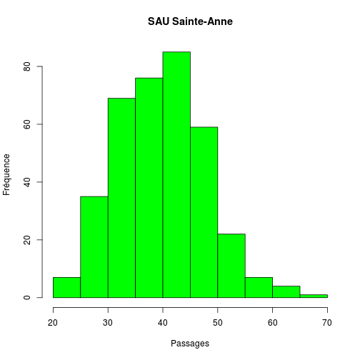

SAU Ste Anne
========================================================

La clinique Ste Anne fournit des données simplifiée de son activité sous forme d'un fichier exel appelé *Copie de 2013 RPU Ste Anne.xlsx*. Il s'agit d'un classeur où chaque page correspond à un mois de l'année 2013.

Chaque page est enregistrée au format *.csv* sous me nom *2013_MM_stanne.csv*. Les lignes vides sont éliminées avant l'enregistrement au format *csv*.

Meagling
--------
- les 2 premières lignes sont ignorées (cellules fusionnées)
- les noms de colonne sont redéfinis
- les dates sont mise au format iso

lecture du fichier:
-------------------
LIGNE 36 AJUSTER LE NOMBRE DE FICHIERS A LIRE (max = 12)

Mesures:
- nb de lignes
- nb total de passages
- tri des passages par catégories
  - d'age:moins de 1 an, 1 à 75 ans, plus de 75ans
  - de devenir: UHCD, hospitalisation, transfert
- taux d'hopitalisation: UHCD + hosp + transfert / total


```r
library("zoo")
```

```
## 
## Attaching package: 'zoo'
## 
## Les objets suivants sont masqués from 'package:base':
## 
##     as.Date, as.Date.numeric
```

```r
library("xts")
source("mes_fonctions.R")
date()
```

```
## [1] "Mon Feb  3 23:38:24 2014"
```


```r
an <- "2013"
hop <- "stanne.csv"
data <- sau(an, hop, max = 12)
```

```
## [1] "2013_01_stanne.csv"
## [1] "2013_02_stanne.csv"
## [1] "2013_03_stanne.csv"
## [1] "2013_04_stanne.csv"
## [1] "2013_05_stanne.csv"
## [1] "2013_06_stanne.csv"
## [1] "2013_07_stanne.csv"
## [1] "2013_08_stanne.csv"
## [1] "2013_09_stanne.csv"
## [1] "2013_10_stanne.csv"
## [1] "2013_11_stanne.csv"
## [1] "2013_12_stanne.csv"
```

```r

# correction erreur
data[7, 7] <- data[7, 5] + data[7, 6]

save(data, file = "StAnne2013.Rda")

str(data)
```

```
## 'data.frame':	365 obs. of  10 variables:
##  $ date        : Date, format: "2013-01-01" "2013-01-02" ...
##  $ finess      : int  670780212 670780212 670780212 670780212 670780212 670780212 670780212 670780212 670780212 670780212 ...
##  $ service     : Factor w/ 1 level "SAU Ste Anne": 1 1 1 1 1 1 1 1 1 1 ...
##  $ inf1an      : int  2 0 2 1 1 0 0 0 0 1 ...
##  $ entre1_75ans: int  27 30 26 25 28 28 38 33 28 35 ...
##  $ sup75ans    : int  1 6 5 6 4 3 9 5 7 2 ...
##  $ total       : int  30 36 33 32 33 31 47 38 35 38 ...
##  $ hospitalises: int  0 0 0 0 0 0 0 0 0 0 ...
##  $ UHCD        : int  5 7 9 8 7 4 9 9 10 4 ...
##  $ tranferts   : int  0 0 0 1 1 0 2 0 1 0 ...
```

```r
head(data)
```

```
##         date    finess      service inf1an entre1_75ans sup75ans total
## 1 2013-01-01 670780212 SAU Ste Anne      2           27        1    30
## 2 2013-01-02 670780212 SAU Ste Anne      0           30        6    36
## 3 2013-01-03 670780212 SAU Ste Anne      2           26        5    33
## 4 2013-01-04 670780212 SAU Ste Anne      1           25        6    32
## 5 2013-01-05 670780212 SAU Ste Anne      1           28        4    33
## 6 2013-01-06 670780212 SAU Ste Anne      0           28        3    31
##   hospitalises UHCD tranferts
## 1            0    5         0
## 2            0    7         0
## 3            0    9         0
## 4            0    8         1
## 5            0    7         1
## 6            0    4         0
```

```r
# edit(data) fix(data)
names(data)
```

```
##  [1] "date"         "finess"       "service"      "inf1an"      
##  [5] "entre1_75ans" "sup75ans"     "total"        "hospitalises"
##  [9] "UHCD"         "tranferts"
```

```r
summary(data$total)
```

```
##    Min. 1st Qu.  Median    Mean 3rd Qu.    Max. 
##    22.0    34.0    40.0    40.2    46.0    69.0
```

```r

min_date <- as.character(min(data$date))
max_date <- as.character(max(data$date))
n_jours <- nrow(data)
n_passages <- sum(data$total)

s <- sapply(data[, 4:10], sum)
p <- round(s/s[4] * 100, 2)
rd <- rbind(s, p)
rd
```

```
##   inf1an entre1_75ans sup75ans total hospitalises    UHCD tranferts
## s 282.00     12805.00  1574.00 14661         4.00 2261.00    250.00
## p   1.92        87.34    10.74   100         0.03   15.42      1.71
```

```r
hospit <- round(sum(s[5:7]/s[4]) * 100, 2)
hospit
```

```
## [1] 17.15
```

```r

data$hosp <- (data[8] + data[9] + data[10])/data[7]
# creation d'une colonne taux hospitalisation
hosp <- (data[8] + data[9] + data[10])/data[7]
names(hosp) <- "tx_hosp"
data <- cbind(data, hosp)
names(data)
```

```
##  [1] "date"         "finess"       "service"      "inf1an"      
##  [5] "entre1_75ans" "sup75ans"     "total"        "hospitalises"
##  [9] "UHCD"         "tranferts"    "hosp"         "tx_hosp"
```

```r
summary(data$hosp)
```

```
##   hospitalises  
##  Min.   :0.000  
##  1st Qu.:0.125  
##  Median :0.178  
##  Mean   :0.173  
##  3rd Qu.:0.216  
##  Max.   :0.345
```


***
### Clinique Sainte Anne 2013 (GHSV)
***
Chiffres clés  |  valeur
------|--------  
date début  | 2013-01-01 
date fin    |  2013-12-31  
nb de jours |  365  
passages    |  14661  
< 1 an  |  282 (1.92 %)
adultes < 75 ans  |  12805 (87.34 %)
plus de 75 ans  |  1574 (10.74 %)
taux hospitalisation  |  17.15 %

***
***

Taux hospitalisation
--------------------

```r
ts <- zoo(data$tx_hosp, data$date)
head(ts)
```

```
## 2013-01-01 2013-01-02 2013-01-03 2013-01-04 2013-01-05 2013-01-06 
##     0.1667     0.1944     0.2727     0.2812     0.2424     0.1290
```

```r
plot(ts, ylab = "Taux hospitalisation", xlab = "2013", main = "SU Ste Anne - Taux d'hospitalisation", 
    col = "lightblue")
lines(rollmean(ts, 7), col = "blue", lwd = 2)
```

 


Données actives
---------------
On ne conserve que les jours renseignés, c'esta dire ceux pour lesquels le total despassages est supérieur à 0:

```r
load("StAnne2013.Rda")
data <- data[data$total > 0, ]
```


Graphiques:
----------

```r
plot(data$date, data$total, type = "l", col = "blue", xlab = "SAU Ste Anne", 
    ylab = "Passages")
```

 

Activité:
---------

### total des passages:

```r
t <- sum(data$total)
t
```

```
## [1] 14661
```

```r
summary(data$total)
```

```
##    Min. 1st Qu.  Median    Mean 3rd Qu.    Max. 
##    22.0    34.0    40.0    40.2    46.0    69.0
```

```r
sd(data$total)
```

```
## [1] 7.986
```

```r
boxplot(data$total, ylab = "nombre", main = "SU Ste Anne 2013 - Tous les passages", 
    col = "yellow")
```

 

```r
hist(data$total, main = "SAU Sainte-Anne", xlab = "Passages", ylab = "Fréquence", 
    col = "green")
```

 

### Entre 1 et 75

```r
t <- sum(data$entre1_75ans)
t
```

```
## [1] 12805
```

```r
summary(data$entre1_75ans)
```

```
##    Min. 1st Qu.  Median    Mean 3rd Qu.    Max. 
##    18.0    30.0    34.0    35.1    40.0    63.0
```

```r
sd(data$entre1_75ans)
```

```
## [1] 7.48
```

```r
boxplot(data$entre1_75ans, ylab = "nombre", main = "SU Ste Anne 2013 - 1 à de 75ans", 
    col = "yellow")
```

 

```r
hist(data$entre1_75ans, main = "SAU Sainte-Anne", xlab = "Passages entre 1 et 75 ans", 
    ylab = "Fréquence", col = "green")
```

 

### Plus de 75ans

```r
t <- sum(data$sup75ans)
t
```

```
## [1] 1574
```

```r
summary(data$sup75ans)
```

```
##    Min. 1st Qu.  Median    Mean 3rd Qu.    Max. 
##    0.00    3.00    4.00    4.31    6.00   12.00
```

```r
sd(data$sup75ans)
```

```
## [1] 2.258
```

```r
boxplot(data$sup75ans, ylab = "nombre", main = "SU Ste Anne 2013 - Plus de 75ans", 
    col = "yellow")
```

 

```r
hist(data$sup75ans, main = "SAU Sainte-Anne", xlab = "Passages des plus de 75 ans", 
    ylab = "Fréquence", col = "lightblue")
```

 


Résumé
=======

```r
a <- apply(as.matrix(data[4:10]), 2, sum)
a
```

```
##       inf1an entre1_75ans     sup75ans        total hospitalises 
##          282        12805         1574        14661            4 
##         UHCD    tranferts 
##         2261          250
```

```r
total <- a[4]
round(a * 100/total, 2)
```

```
##       inf1an entre1_75ans     sup75ans        total hospitalises 
##         1.92        87.34        10.74       100.00         0.03 
##         UHCD    tranferts 
##        15.42         1.71
```


Utilisation de zoo
==================
ref: livre R_cookbook Chap.14 pp 355 (time series)

Création d'un objet de type *zoo* capable de manipuler les séries temporelles

*zoo* demande au minimum une variable data pour les données à analyser (vecteur ou matrice) et une seconde variable *date* qui indique quelle colonne sera utilisée pour les dates.

```r
library("zoo")
ts <- zoo(as.matrix(data[4:10]), data$date)
head(ts)
```

```
##            inf1an entre1_75ans sup75ans total hospitalises UHCD tranferts
## 2013-01-01      2           27        1    30            0    5         0
## 2013-01-02      0           30        6    36            0    7         0
## 2013-01-03      2           26        5    33            0    9         0
## 2013-01-04      1           25        6    32            0    8         1
## 2013-01-05      1           28        4    33            0    7         1
## 2013-01-06      0           28        3    31            0    4         0
```

```r
plot(ts)
```

 

```r
lines(rollmean(ts, 7), col = "red", lwd = 2)
```

```
## Error: Can't plot lines for multivariate zoo object
```

```r

delta <- diff(ts)
```

Moyenne lissée sur 7 jours

```r
ma <- rollmean(ts, 7)
# ma
plot(ma, main = "Moyenne lissée sur 7 jours")
```

 

Utilisation de *xts*
====================
Un autre gestionnaire de séries temporelles

```r
library("xts")
ts <- xts(as.matrix(data[4:10]), data$date)
head(ts)
```

```
##            inf1an entre1_75ans sup75ans total hospitalises UHCD tranferts
## 2013-01-01      2           27        1    30            0    5         0
## 2013-01-02      0           30        6    36            0    7         0
## 2013-01-03      2           26        5    33            0    9         0
## 2013-01-04      1           25        6    32            0    8         1
## 2013-01-05      1           28        4    33            0    7         1
## 2013-01-06      0           28        3    31            0    4         0
```

```r
plot(ts$total, main = "Clinique Ste Anne", xlab = "Passages quotidiens au SU", 
    ylab = "Nombre")
lines(rollmean(ts$total, 7), col = "red", lwd = 2)
```

 

Moyenne par semaine:
-------------------

```r
apply.weekly(ts, mean)
```

```
##            inf1an entre1_75ans sup75ans total hospitalises  UHCD tranferts
## 2013-01-06 1.0000        27.33    4.167 32.50       0.0000 6.667    0.3333
## 2013-01-13 0.7143        35.57    5.000 41.29       0.0000 6.429    0.5714
## 2013-01-20 1.1429        34.00    4.429 39.57       0.0000 7.143    0.1429
## 2013-01-27 0.8571        38.29    5.429 44.57       0.0000 8.000    0.2857
## 2013-02-03 1.1429        34.86    5.143 41.14       0.0000 8.000    0.1429
## 2013-02-10 0.5714        38.43    4.857 43.86       0.0000 7.000    0.0000
## 2013-02-17 0.7143        37.29    5.143 43.14       0.0000 8.571    0.1429
## 2013-02-24 0.7143        31.29    4.857 36.86       0.0000 7.286    0.0000
## 2013-03-03 1.0000        32.57    4.714 38.29       0.0000 8.571    0.0000
## 2013-03-10 0.8571        37.00    5.429 43.29       0.0000 7.714    0.0000
## 2013-03-17 1.8571        32.86    4.857 39.57       0.0000 7.143    0.0000
## 2013-03-24 1.0000        38.14    5.571 44.71       0.0000 8.000    0.0000
## 2013-03-31 1.0000        32.57    5.286 38.86       0.0000 6.000    0.8571
## 2013-04-07 0.5714        38.57    4.571 43.71       0.0000 9.714    0.0000
## 2013-04-14 0.2857        35.43    4.143 39.86       0.0000 7.000    0.0000
## 2013-04-21 0.2857        32.00    3.286 35.57       0.0000 5.286    0.0000
## 2013-04-28 0.1429        30.14    3.000 33.29       0.0000 6.000    0.0000
## 2013-05-05 0.4286        36.14    3.000 39.57       0.0000 5.286    0.4286
## 2013-05-12 0.7143        41.86    4.429 47.00       0.0000 6.143    0.4286
## 2013-05-19 0.8571        33.29    2.857 37.00       0.0000 6.143    1.1429
## 2013-05-26 0.4286        30.29    4.286 35.00       0.0000 6.286    1.2857
## 2013-06-02 0.4286        37.43    4.429 42.29       0.0000 6.571    0.5714
## 2013-06-09 0.1429        40.86    4.571 45.57       0.0000 5.857    1.4286
## 2013-06-16 0.2857        34.29    3.857 38.43       0.0000 6.429    1.0000
## 2013-06-23 0.7143        39.57    5.286 45.57       0.0000 7.286    0.7143
## 2013-06-30 0.7143        29.00    4.286 34.00       0.0000 6.286    0.5714
## 2013-07-07 0.2857        36.57    4.286 41.14       0.0000 5.143    0.0000
## 2013-07-14 0.5714        35.00    5.143 40.71       0.0000 6.429    1.5714
## 2013-07-21 0.8571        36.00    4.429 41.29       0.0000 6.143    1.1429
## 2013-07-28 0.4286        33.86    2.714 37.00       0.0000 4.143    0.1429
## 2013-08-04 0.2857        32.00    5.143 37.43       0.0000 6.000    1.4286
## 2013-08-11 1.1429        32.71    5.000 38.86       0.0000 7.857    0.7143
## 2013-08-18 1.1429        32.86    3.429 37.43       0.0000 5.857    1.1429
## 2013-08-25 0.8571        28.86    5.429 35.14       0.0000 4.714    0.1429
## 2013-09-01 0.1429        33.43    3.571 37.14       0.0000 3.286    0.7143
## 2013-09-08 0.5714        32.29    4.286 37.14       0.0000 4.429    0.2857
## 2013-09-15 0.4286        34.57    3.571 38.57       0.0000 4.571    1.2857
## 2013-09-22 0.1429        37.43    4.714 42.29       0.0000 5.286    1.0000
## 2013-09-29 0.2857        40.43    3.429 44.14       0.5714 5.571    0.8571
## 2013-10-06 1.2857        40.43    3.571 45.29       0.0000 7.857    1.0000
## 2013-10-13 1.4286        36.71    3.857 42.00       0.0000 5.286    0.7143
## 2013-10-20 1.0000        39.14    3.571 43.71       0.0000 5.286    1.2857
## 2013-10-27 0.8571        32.86    3.429 37.14       0.0000 3.857    1.0000
## 2013-11-03 0.7143        31.29    3.857 35.86       0.0000 5.429    1.1429
## 2013-11-10 0.5714        33.57    6.571 40.71       0.0000 5.857    1.5714
## 2013-11-17 1.0000        36.86    4.286 42.14       0.0000 4.571    1.2857
## 2013-11-24 0.5714        38.57    4.286 43.43       0.0000 6.286    1.7143
## 2013-12-01 1.2857        37.86    2.857 42.00       0.0000 4.571    1.1429
## 2013-12-08 1.8571        29.43    3.429 34.71       0.0000 5.286    0.7143
## 2013-12-15 0.8571        32.71    4.000 37.57       0.0000 5.571    0.8571
## 2013-12-22 0.4286        41.71    3.429 45.57       0.0000 6.429    0.8571
## 2013-12-29 2.5714        38.71    5.286 46.57       0.0000 6.286    1.4286
## 2013-12-31 1.0000        29.00    3.500 33.50       0.0000 4.000    2.0000
```

```r
apply.weekly(ts, sd)
```

```
##             [,1]
## 2013-01-06 12.91
## 2013-01-13 16.81
## 2013-01-20 16.27
## 2013-01-27 18.69
## 2013-02-03 16.59
## 2013-02-10 18.55
## 2013-02-17 17.82
## 2013-02-24 14.73
## 2013-03-03 15.69
## 2013-03-10 17.72
## 2013-03-17 16.00
## 2013-03-24 18.84
## 2013-03-31 15.73
## 2013-04-07 18.25
## 2013-04-14 16.77
## 2013-04-21 15.09
## 2013-04-28 14.20
## 2013-05-05 17.15
## 2013-05-12 19.78
## 2013-05-19 15.59
## 2013-05-26 14.41
## 2013-06-02 17.53
## 2013-06-09 19.08
## 2013-06-16 16.16
## 2013-06-23 18.85
## 2013-06-30 14.21
## 2013-07-07 17.57
## 2013-07-14 16.62
## 2013-07-21 17.22
## 2013-07-28 16.03
## 2013-08-04 15.15
## 2013-08-11 16.12
## 2013-08-18 15.63
## 2013-08-25 14.34
## 2013-09-01 15.93
## 2013-09-08 15.43
## 2013-09-15 16.38
## 2013-09-22 17.79
## 2013-09-29 19.36
## 2013-10-06 19.07
## 2013-10-13 17.39
## 2013-10-20 18.35
## 2013-10-27 15.83
## 2013-11-03 15.23
## 2013-11-10 16.40
## 2013-11-17 17.65
## 2013-11-24 17.96
## 2013-12-01 17.68
## 2013-12-08 14.27
## 2013-12-15 15.70
## 2013-12-22 19.65
## 2013-12-29 18.73
## 2013-12-31 14.01
```

on peut essayer:
- apply.daily(ts, f)
- apply.weekly(ts, f)
- apply.monthly(ts, f)
- apply.quarterly(ts, f)
- apply.yearly(ts, f)

Note: on peut convertir un objet *zoo* en onjet *xts*: apply.monthly(as.xts(ts), f)

### Mesure de l'auto-corrélation:

```r
acf(ts$total)
```

 


