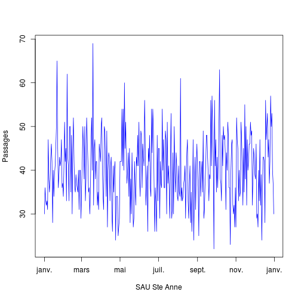
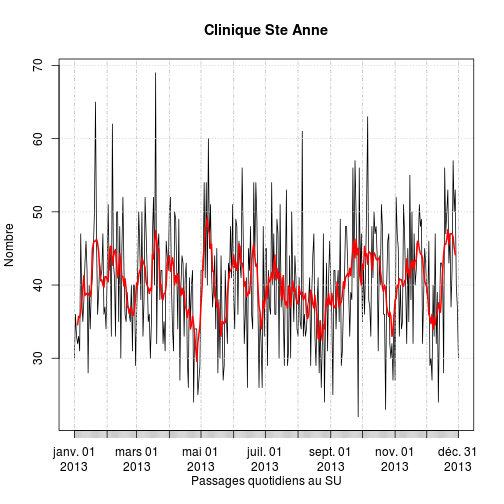

SAU Ste Anne
========================================================

La clinique Ste Anne fournit des données simplifiée de son activité sous forme d'un fichier exel appelé *Copie de 2013 RPU Ste Anne.xlsx*. Il s'agit d'un classeur où chaque page correspond à un mois de l'année 2013.

Chaque page est enregistrée au format *.csv* sous me nom *2013_MM_stanne.csv*. Les lignes vides sont éliminées avant l'enregistrement au format *csv*.

Meagling
--------
- les 2 premières lignes sont ignorées (cellules fusionnées)
- les noms de colonne sont redéfinis
- les dates sont mise au format iso

lecture du fichier:
-------------------

```r
date()
```

```
## [1] "Wed Sep 11 12:08:29 2013"
```

```r

source("mes_fonctions.R")
an <- "2013"
hop <- "stanne.csv"
data <- sau(an, hop, max = 7)
```

```
## [1] "2013_01_stanne.csv"
## [1] "2013_02_stanne.csv"
## [1] "2013_03_stanne.csv"
## [1] "2013_04_stanne.csv"
## [1] "2013_05_stanne.csv"
## [1] "2013_06_stanne.csv"
## [1] "2013_07_stanne.csv"
```

```r

str(data)
```

```
## 'data.frame':	212 obs. of  10 variables:
##  $ date        : Date, format: "2013-01-01" "2013-01-02" ...
##  $ finess      : int  670780212 670780212 670780212 670780212 670780212 670780212 670780212 670780212 670780212 670780212 ...
##  $ service     : Factor w/ 1 level "SAU Ste Anne": 1 1 1 1 1 1 1 1 1 1 ...
##  $ inf1an      : int  2 0 2 1 1 0 0 0 0 1 ...
##  $ entre1_75ans: int  27 30 26 25 28 28 38 33 28 35 ...
##  $ sup75ans    : int  1 6 5 6 4 3 9 5 7 2 ...
##  $ total       : int  30 36 33 32 33 31 0 38 35 38 ...
##  $ hospitalises: int  0 0 0 0 0 0 0 0 0 0 ...
##  $ UHCD        : int  5 7 9 8 7 4 9 9 10 4 ...
##  $ tranferts   : int  0 0 0 1 1 0 2 0 1 0 ...
```

```r
head(data)
```

```
##         date    finess      service inf1an entre1_75ans sup75ans total
## 1 2013-01-01 670780212 SAU Ste Anne      2           27        1    30
## 2 2013-01-02 670780212 SAU Ste Anne      0           30        6    36
## 3 2013-01-03 670780212 SAU Ste Anne      2           26        5    33
## 4 2013-01-04 670780212 SAU Ste Anne      1           25        6    32
## 5 2013-01-05 670780212 SAU Ste Anne      1           28        4    33
## 6 2013-01-06 670780212 SAU Ste Anne      0           28        3    31
##   hospitalises UHCD tranferts
## 1            0    5         0
## 2            0    7         0
## 3            0    9         0
## 4            0    8         1
## 5            0    7         1
## 6            0    4         0
```

```r
# edit(data) fix(data)
names(data)
```

```
##  [1] "date"         "finess"       "service"      "inf1an"      
##  [5] "entre1_75ans" "sup75ans"     "total"        "hospitalises"
##  [9] "UHCD"         "tranferts"
```

```r
summary(data$total)
```

```
##    Min. 1st Qu.  Median    Mean 3rd Qu.    Max. 
##       0      34      40      40      45      69
```


Données actives
---------------
On ne conserve que les jours renseignés, c'esta dire ceux pour lesquels le total despassages est supérieur à 0:

```r
data <- data[data$total > 0, ]
```


Graphiques:
----------

```r
plot(data$date, data$total, type = "l", col = "blue", xlab = "SAU Ste Anne", 
    ylab = "Passages")
```

 

Activité:
---------

### total des passages:

```r
t <- sum(data$total)
t
```

```
## [1] 8472
```

```r
summary(data$total)
```

```
##    Min. 1st Qu.  Median    Mean 3rd Qu.    Max. 
##    24.0    34.5    40.0    40.2    45.0    69.0
```

```r
sd(data$total)
```

```
## [1] 7.85
```

```r
boxplot(data$total)
```

 

```r
hist(data$total, main = "SAU Sainte-Anne", xlab = "Passages", ylab = "Fréquence", 
    col = "green")
```

 

### Entre 1 et 75

```r
t <- sum(data$entre1_75ans)
t
```

```
## [1] 7393
```

```r
summary(data$entre1_75ans)
```

```
##    Min. 1st Qu.  Median    Mean 3rd Qu.    Max. 
##      18      30      34      35      40      63
```

```r
sd(data$entre1_75ans)
```

```
## [1] 7.243
```

```r
boxplot(data$entre1_75ans)
```

 

```r
hist(data$entre1_75ans, main = "SAU Sainte-Anne", xlab = "Passages entre 1 et 75 ans", 
    ylab = "Fréquence", col = "green")
```

 

Résumé
=======

```r
a <- apply(as.matrix(data[4:10]), 2, sum)
a
```

```
##       inf1an entre1_75ans     sup75ans        total hospitalises 
##          144         7393          935         8472            0 
##         UHCD    tranferts 
##         1419           93
```

```r
total <- a[4]
round(a * 100/total, 2)
```

```
##       inf1an entre1_75ans     sup75ans        total hospitalises 
##         1.70        87.26        11.04       100.00         0.00 
##         UHCD    tranferts 
##        16.75         1.10
```

Utilisation de zoo
==================
ref: livre R_cookbook Chap.14 pp 355 (time series)

Création d'un objet de type *zoo* capable de manipuler les séries temporelles

*zoo* demande au minimum une variable data pour les données à analyser (vecteur ou matrice) et une seconde variable *date* qui indique quelle colonne sera utilisée pour les dates.

```r
library("zoo")
```

```
## Attaching package: 'zoo'
## 
## The following object(s) are masked from 'package:base':
## 
## as.Date, as.Date.numeric
```

```r
ts <- zoo(as.matrix(data[4:10]), data$date)
head(ts)
```

```
##            inf1an entre1_75ans sup75ans total hospitalises UHCD tranferts
## 2013-01-01      2           27        1    30            0    5         0
## 2013-01-02      0           30        6    36            0    7         0
## 2013-01-03      2           26        5    33            0    9         0
## 2013-01-04      1           25        6    32            0    8         1
## 2013-01-05      1           28        4    33            0    7         1
## 2013-01-06      0           28        3    31            0    4         0
```

```r
plot(ts)
```

 

```r
delta <- diff(ts)
```

Moyenne lissée sur 7 jours

```r
ma <- rollmean(ts, 7)
# ma
plot(ma, main = "Moyenne lissée sur 7 jours")
```

 

Utilisation de *xts*
====================
Un autre gestionnaire de séries temporelles

```r
library("xts", lib.loc = "/home/jcb/R/x86_64-pc-linux-gnu-library/2.15")
ts <- xts(as.matrix(data[4:10]), data$date)
head(ts)
```

```
##            inf1an entre1_75ans sup75ans total hospitalises UHCD tranferts
## 2013-01-01      2           27        1    30            0    5         0
## 2013-01-02      0           30        6    36            0    7         0
## 2013-01-03      2           26        5    33            0    9         0
## 2013-01-04      1           25        6    32            0    8         1
## 2013-01-05      1           28        4    33            0    7         1
## 2013-01-06      0           28        3    31            0    4         0
```

```r
plot(ts$total, main = "Clinique Ste Anne", xlab = "Passages quotidiens au SU", 
    ylab = "Nombre")
```

 

Moyenne par semaine:

```r
apply.weekly(ts, mean)
```

```
##            inf1an entre1_75ans sup75ans total hospitalises  UHCD tranferts
## 2013-01-06 1.0000        27.33    4.167 32.50            0 6.667    0.3333
## 2013-01-13 0.8333        35.17    4.333 40.33            0 6.000    0.3333
## 2013-01-20 1.1429        34.00    4.429 39.57            0 7.143    0.1429
## 2013-01-27 0.8571        38.29    5.429 44.57            0 8.000    0.2857
## 2013-02-03 1.1429        34.86    5.143 41.14            0 8.000    0.1429
## 2013-02-10 0.5714        38.43    4.857 43.86            0 7.000    0.0000
## 2013-02-17 0.7143        37.29    5.143 43.14            0 8.571    0.1429
## 2013-02-24 0.7143        31.29    4.857 36.86            0 7.286    0.0000
## 2013-03-03 1.0000        32.57    4.714 38.29            0 8.571    0.0000
## 2013-03-10 0.8571        37.00    5.429 43.29            0 7.714    0.0000
## 2013-03-17 1.8571        32.86    4.857 39.57            0 7.143    0.0000
## 2013-03-24 1.0000        38.14    5.571 44.71            0 8.000    0.0000
## 2013-03-31 1.0000        32.57    5.286 38.86            0 6.000    0.8571
## 2013-04-07 0.5714        38.57    4.571 43.71            0 9.714    0.0000
## 2013-04-14 0.2857        35.43    4.143 39.86            0 7.000    0.0000
## 2013-04-21 0.2857        32.00    3.286 35.57            0 5.286    0.0000
## 2013-04-28 0.1429        30.14    3.000 33.29            0 6.000    0.0000
## 2013-05-05 0.4286        36.14    3.000 39.57            0 5.286    0.4286
## 2013-05-12 0.7143        41.86    4.429 47.00            0 6.143    0.4286
## 2013-05-19 0.8571        33.29    2.857 37.00            0 6.143    1.1429
## 2013-05-26 0.4286        30.29    4.286 35.00            0 6.286    1.2857
## 2013-06-02 0.4286        37.43    4.429 42.29            0 6.571    0.5714
## 2013-06-09 0.1429        40.86    4.571 45.57            0 5.857    1.4286
## 2013-06-16 0.2857        34.29    3.857 38.43            0 6.429    1.0000
## 2013-06-23 0.7143        39.57    5.286 45.57            0 7.286    0.7143
## 2013-06-30 0.7143        29.00    4.286 34.00            0 6.286    0.5714
## 2013-07-07 0.2857        36.57    4.286 41.14            0 5.143    0.0000
## 2013-07-14 0.5714        35.00    5.143 40.71            0 6.429    1.5714
## 2013-07-21 0.8571        36.00    4.429 41.29            0 6.143    1.1429
## 2013-07-28 0.4286        33.86    2.714 37.00            0 4.143    0.1429
## 2013-07-31 0.0000        35.00    4.667 39.67            0 5.333    1.6667
```

```r
apply.weekly(ts, sd)
```

```
##            inf1an entre1_75ans sup75ans  total hospitalises  UHCD
## 2013-01-06 0.8944        1.751   1.9408  2.074            0 1.862
## 2013-01-13 1.6021        4.355   1.9664  4.033            0 2.898
## 2013-01-20 0.6901        6.272   1.9024  7.138            0 2.795
## 2013-01-27 1.0690       11.280   4.0356  9.537            0 1.826
## 2013-02-03 1.0690        4.059   2.2678  6.149            0 2.236
## 2013-02-10 0.5345        8.619   2.9681 10.107            0 3.367
## 2013-02-17 0.7559        6.157   3.3877  8.092            0 4.117
## 2013-02-24 0.4880        1.890   2.0354  1.952            0 1.254
## 2013-03-03 0.8165        7.323   2.1381  7.088            0 2.760
## 2013-03-10 1.0690        6.110   2.3705  7.064            0 3.638
## 2013-03-17 2.1157        5.336   2.1931  7.764            0 3.532
## 2013-03-24 0.8165       10.885   2.1492 11.772            0 4.243
## 2013-03-31 1.1547        6.779   2.5635  6.067            0 1.732
## 2013-04-07 0.7868        7.591   1.7182  8.616            0 1.380
## 2013-04-14 0.4880        6.425   2.5448  7.244            0 2.582
## 2013-04-21 0.4880        5.715   0.7559  6.373            0 2.059
## 2013-04-28 0.3780        5.460   2.5166  6.800            0 2.000
## 2013-05-05 0.5345        8.454   1.6330  9.108            0 1.380
## 2013-05-12 0.7559        6.914   2.2991  8.287            0 1.864
## 2013-05-19 1.0690        6.945   1.4639  6.608            0 1.773
## 2013-05-26 0.5345        6.157   1.6036  6.325            0 3.638
## 2013-06-02 0.7868        4.541   2.5071  5.765            0 1.902
## 2013-06-09 0.3780        6.414   1.9024  6.399            0 1.345
## 2013-06-16 0.7559        6.824   2.1157  7.502            0 1.718
## 2013-06-23 0.7559        7.115   3.7289  8.039            0 1.976
## 2013-06-30 1.1127        8.563   2.8702  7.550            0 3.094
## 2013-07-07 0.7559        8.810   3.0938  8.030            0 2.035
## 2013-07-14 0.7868        6.191   0.8997  7.158            0 2.225
## 2013-07-21 1.0690        8.000   1.7182  8.460            0 2.610
## 2013-07-28 0.7868        6.669   1.7043  7.958            0 1.574
## 2013-07-31 0.0000        5.292   0.5774  5.132            0 2.082
##            tranferts
## 2013-01-06    0.5164
## 2013-01-13    0.5164
## 2013-01-20    0.3780
## 2013-01-27    0.7559
## 2013-02-03    0.3780
## 2013-02-10    0.0000
## 2013-02-17    0.3780
## 2013-02-24    0.0000
## 2013-03-03    0.0000
## 2013-03-10    0.0000
## 2013-03-17    0.0000
## 2013-03-24    0.0000
## 2013-03-31    0.8997
## 2013-04-07    0.0000
## 2013-04-14    0.0000
## 2013-04-21    0.0000
## 2013-04-28    0.0000
## 2013-05-05    0.7868
## 2013-05-12    0.5345
## 2013-05-19    1.2150
## 2013-05-26    0.9512
## 2013-06-02    0.7868
## 2013-06-09    1.1339
## 2013-06-16    0.8165
## 2013-06-23    1.4960
## 2013-06-30    0.7868
## 2013-07-07    0.0000
## 2013-07-14    1.3973
## 2013-07-21    1.0690
## 2013-07-28    0.3780
## 2013-07-31    0.5774
```

on peut essayer:
- apply.daily(ts, f)
- apply.weekly(ts, f)
- apply.monthly(ts, f)
- apply.quarterly(ts, f)
- apply.yearly(ts, f)

Note: on peut convertir un objet *zoo* en onjet *xts*: apply.monthly(as.xts(ts), f)

Mesure de l'auto-corrélation:

```r
acf(ts$total)
```

 


